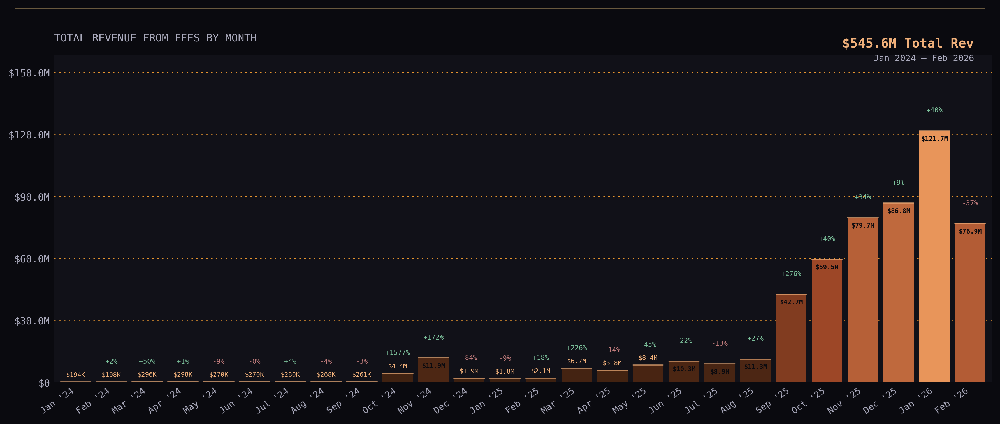
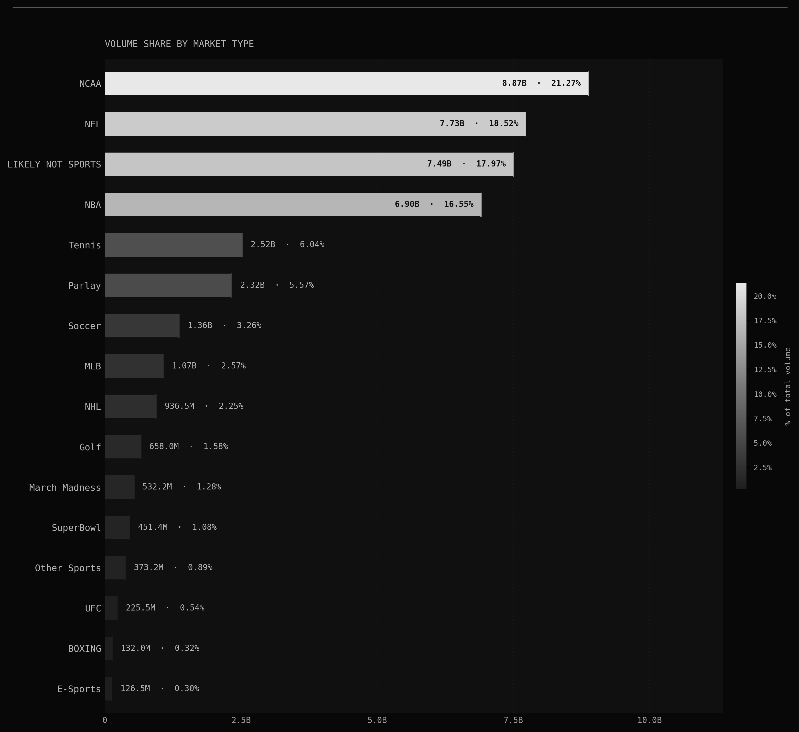
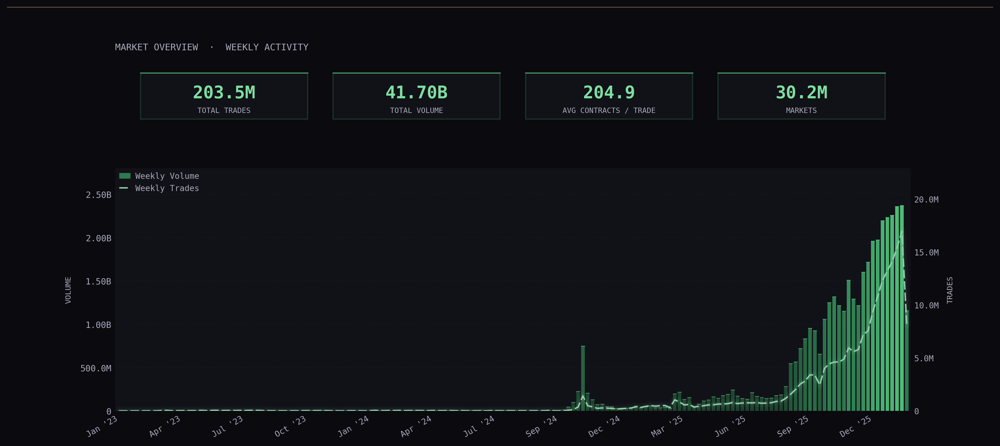
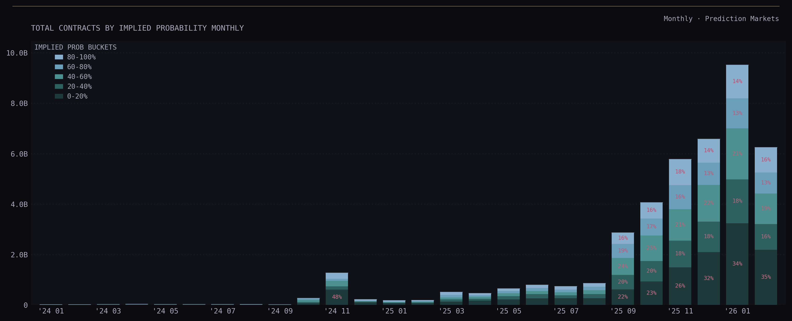
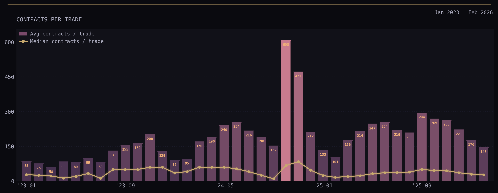

### For an article I'm writing: 

1. I'm hitting prediction market's APIs (Kalshi + Polymarket)
2. I'm gathering onchain data (Polygon) 

This is a series of haphazard scripts that are useful for specific data points that I'm writing about. If you're looking for inspiration or similar data, feel free to use this. Cheers.

### Some of the Outputs

